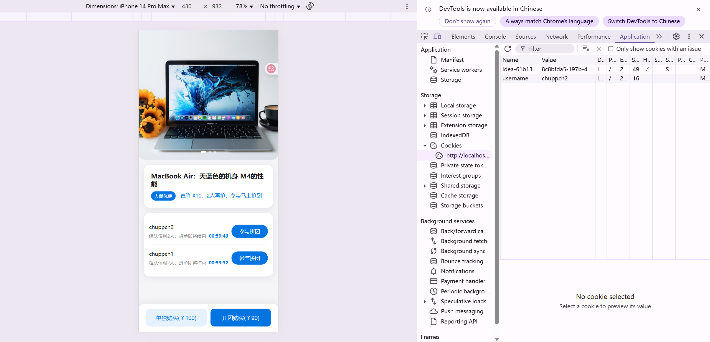

# 🎯 分布式拼团系统（全链路高并发交易平台）

[](https://www.oracle.com/java/technologies/javase/javase8-archive-downloads.html)
[](https://spring.io/projects/spring-boot)
[](https://maven.apache.org/)


该系统是一个具备完整交易流程的高并发电商拼团系统，支持试算、锁单、结算三阶段交易逻辑。通过 DDD 领域驱动设计 + 微服务架构，实现多模块协同、异步解耦、规则统一处理。适用于类似「拼多多」、「美团」、「京东」等支持用户拼团促销的业务场景，助力提升交易转化与私域传播。

------
## 🚀 项目亮点概览

- ✳ **全链路交易编排**：试算 → 锁单 → 结算，全流程解耦设计
- 🧠 **DDD 领域建模**：活动域、人群域、交易域解耦清晰
- 🧩 **通用设计模式抽象**：责任链 + 规则树，替代繁杂 if...else 分支
- ⛓ **高并发友好**：异步解耦、无锁库存增强系统韧性
- 📦 **全栈式开发**：前后端 + DevOps 一体化，涵盖页面、接口、配置、监控
- 🧱 **高扩展性**：模块化插件式架构，便于功能拆卸和新业务接入

------

## 🧱 架构设计

| 模块     | 说明                                       |
| -------- | ------------------------------------------ |
| 活动领域 | 定义拼团活动规则、折扣策略、生命周期管理等 |
| 人群领域 | 构建标签体系、BitMap 筛选可参与人群        |
| 交易领域 | 拼团试算、锁单、结算主流程                 |
| 公共中台 | 抽象责任链、规则树、策略模式模板           |
| 资源层   | 提供 RESTful HTTP 接口                     |
| 配置中心 | 支持动态属性控制（Redis + 注解 AOP）       |
|          |                                            |


------

## 🛠 技术栈

| 层级       | 技术                                          |
| ---------- | --------------------------------------------- |
| 微服务框架 | Spring Boot、Spring Cloud                     |
| ORM        | MyBatis                                       |
| 持久化     | MySQL、Redis（BitMap/Cache）、MongoDB（可选） |
| 消息队列   | RabbitMQ                                      |
| 配置中心   | 自研 DCC / Apollo                             |
| 分布式通信 | Feign、Retrofit2、gRPC                        |
| 分布式锁   | Redis 锁（Lua 脚本）                          |
| 接口调用   | OkHttp3、Feign、Nginx负载均衡                 |
| 前端技术   | HTML、CSS、JavaScript                         |
| 监控与运维 | Prometheus、Docker、Skywalking                |


------

## 🧩 通用设计模式抽象

### ☑ 责任链模式（Chain of Responsibility）

- 用于拼团试算、锁单、结算中多级规则校验
- 动态组合不同责任执行链，链执行顺序清晰
- 链组装与执行分离，增强灵活性（非传统单例链设计）

### ☑ 规则树（Rule Tree）

- 提炼试算场景中“开关控制 → 折扣判断 → 人群判断 → 异常兜底”等逻辑
- 增强决策流程可视化与可测试性
- 可用于后续 A/B 测试、灰度策略实现

### ☑ 策略模式

- 折扣计算策略（满减 MJ、直减 ZJ、按人均 NYG）
- 可根据配置动态切换，不修改原有逻辑

------

## 🔁 核心交易链路设计

### 🔍 拼团试算

- 异步线程池并发加载营销配置
- 使用规则树 + 责任链判断用户资格、开关、标签、折扣
- Supplier 函数式封装 DAO 缓存加载逻辑

### 🔒 拼团锁单

- 校验拼团状态、人数上限、活动时间、用户参与资格
- Redis 分布式锁控制并发下单

### 💰 拼团结算

- 双通道触达机制：MQ + HTTP 回调
- 配合一致性任务补偿，保障可靠性
- 黑名单渠道过滤、拼团组状态校验、交易合法性检查

------

## 🧪 示例代码片段

```
java复制编辑// 拼团试算折扣计算 Supplier 模板
DiscountVO discountVO = discountTemplate.execute(() -> {
    return activityRepository.queryGroupBuyActivityDiscountVO(activityId, userId);
});
java复制编辑// 拼团结算责任链执行（责任链 + 工厂组装）
groupBuySettlementChain.execute(context);
java复制编辑// Redis BitSet 人群标签筛选
boolean canParticipate = redisBitSetService.contains("activity:1234:bitset", userId);
```

------

## 🧰 DevOps 说明

- 🌐 支持一键部署脚本（Docker Compose）


------

## 📈 项目演示图（移动端）


------

## 📌 TODO & 扩展

- ⚙️ 接入 Sentinel 进行服务限流与熔断治理，提升系统在高并发场景下的稳定性

- 🎯 支持多类营销活动策略组合，如拼团 + 秒杀 + 满减叠加，提升营销多样性

- 🛠 构建统一后台运营管理系统，实现活动配置、人群策略、拼团模板的可视化管理

- 📱 支持微信小程序端适配，重构 H5 页面以提升移动端用户体验

- 🔄 完善 MQ 消息通道的熔断、失败重试与链路监控机制，保障消息投递可靠性

- 💳 接入微信支付功能，支持拼团支付场景下的实时交易结算

- 🔐 实现系统级的权限模型，包括资源建权、用户鉴权、访问控制等安全机制

- 🧬 完善人群标签的生成、维护与筛选策略，实现更精细化的用户分层运营


------

如你也对领域驱动设计、复杂交易建模有兴趣，欢迎 Star 🌟、Fork 🍴 或提 PR 贡献！

